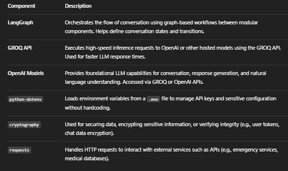

=== Medical History Setup ===

Exemples:

Enter any allergies (comma-separated): penicillin, aspirin
Enter existing medical conditions (comma-separated): hypertension
You: I've had chest pain that radiates to my left arm for the last hour

=== Medical Chat ===

Enter any allergies (comma-separated): penicillin, codeine
Enter existing medical conditions (comma-separated): diabetes
I've had a sore throat and mild fever for two days, and my blood sugar has been higher than usual

---

Architecture :

Architecture :
📁 src/
├── core/
│ ├── conversation.py # Handles conversation logic (turn-taking, user input processing)
│ ├── workflow.py # Orchestrates LangGraph workflows and graph execution
│ └── **init**.py # Initializes core package
│
├── integrations/
│ ├── emergency_services.py # API calls or logic related to external emergency services
│ └── **init**.py # Integration-level initialization
│
├── knowledge_graph/
│ ├── medical_knowledge.py # Domain-specific knowledge representation (e.g., symptoms, conditions)
│ └── **init**.py
│
├── utils/
│ ├── safety.py # Safety filters, moderation checks (e.g., OpenAI content filter)
│ └── **init**.py
│
├── tests/ # Unit or integration test files (currently empty)

first lance in commande line : to start the application

python -m venv env
pip install -r .\requirements.txt
streamlit run .\app.py

app.py:

The main entry point. responsible for: - Loading environment variables with python-dotenv - Initializing LangGraph - Running the chatbot loop (CLI or web)

.env:
Stores your secrets like: - GROQ_API_KEY=your_groq_key - OPENAI_API_KEY=your_openai_key

requirements.txt: - Lists dependencies

medical_system.log: - a runtime log storing system messages, errors, or chat history for debugging or analysis.

.gitignore: - Ignores files/folders like **pycache**/, .env, and venv/.

---

