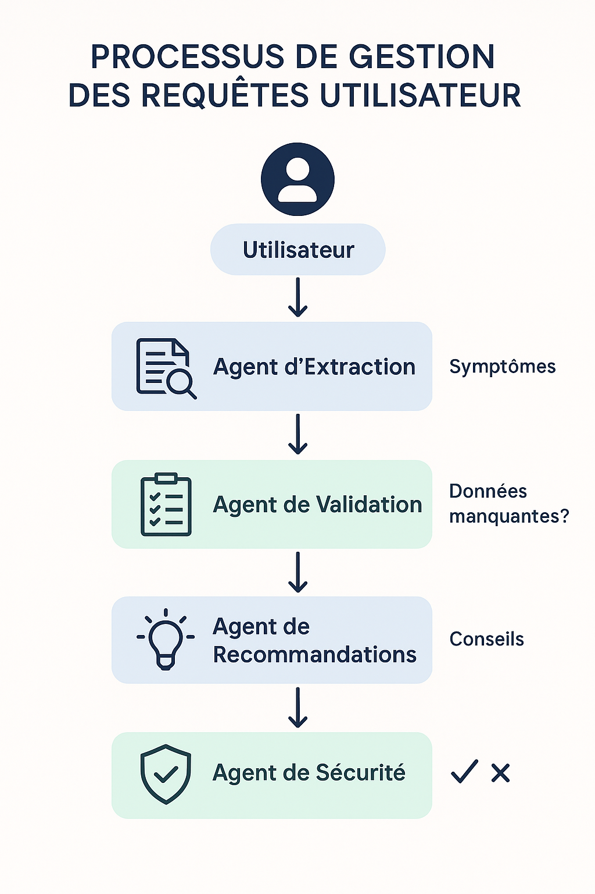
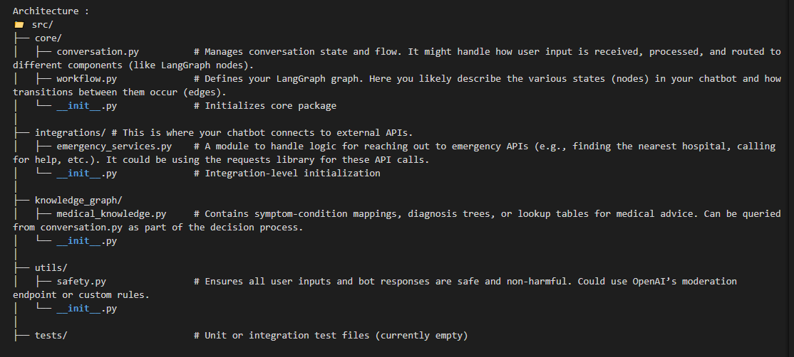

=== Medical History Setup ===

Exemples:

Enter any allergies (comma-separated): penicillin, aspirin
Enter existing medical conditions (comma-separated): hypertension
You: I've had chest pain that radiates to my left arm for the last hour

=== Medical Chat ===

Enter any allergies (comma-separated): penicillin, codeine
Enter existing medical conditions (comma-separated): diabetes
I've had a sore throat and mild fever for two days, and my blood sugar has been higher than usual

---

Architecture :

main.py:

The main entry point. Likely responsible for: - Loading environment variables with python-dotenv - Initializing LangGraph - Running the chatbot loop (CLI or web)

.env:
Stores your secrets like: - GROQ_API_KEY=your_groq_key - OPENAI_API_KEY=your_openai_key

requirements.txt: - Lists your dependencies

medical_system.log: - a runtime log storing system messages, errors, or chat history for debugging or analysis.

.gitignore: - Ignores files/folders like **pycache**/, .env, and venv/.

---

